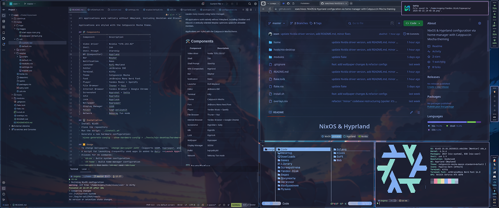
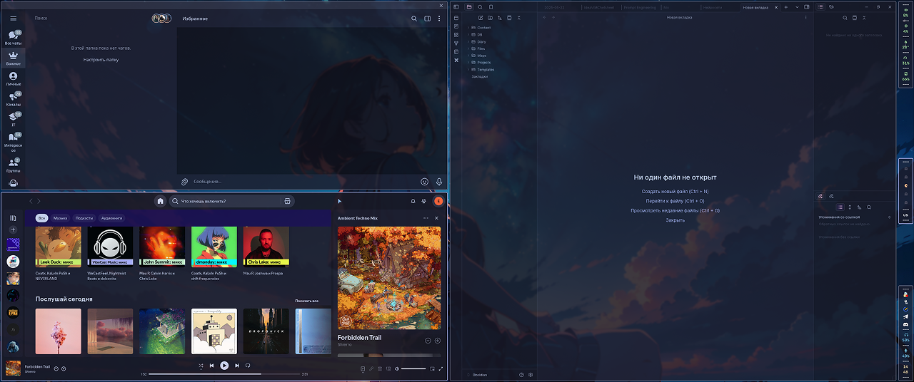
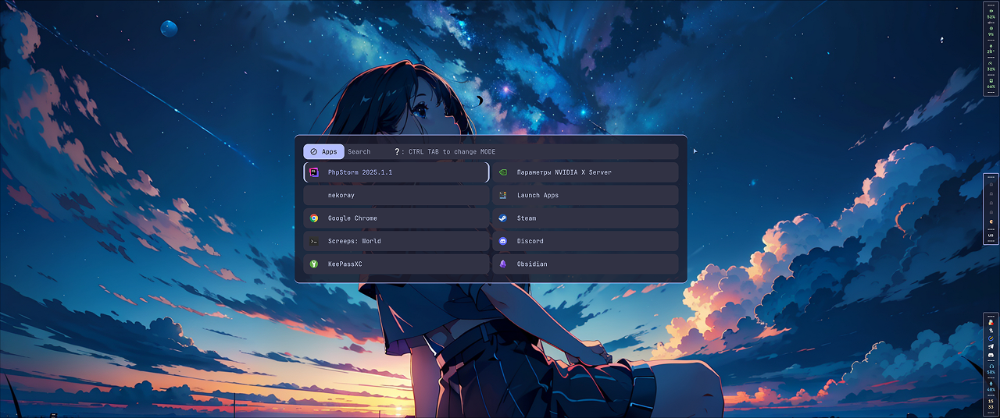

<h1 align="center">NixOS & Hyprland</h1>

## Table of Contents
- [Description](#-description)
- [Components](#-components)
- [Installation](#-installation)
- [Usage](#-usage)

## 📄 Description
A stable NixOS, Hyprland, and Nvidia configuration (Nvidia typically causes many issues) using home-manager.

All applications work natively without XWayland, including Obsidian and Discord. A vertically-oriented Waybar optimizes space for ultrawide monitors.

Applications are styled with the Catppuccin Mocha theme.

## 🛠️ Components
| Component        | Description                    |
|------------------|--------------------------------|
| Video driver     | Nvidia "575.64.05"             |
| Shell            | Zsh                            |
| Shell Prompt     | Starship                       |
| WM (Compositor)  | Hyprland                       |
| Bar              | Waybar                         |
| Notification     | Mako                           |
| Launcher         | Rofi-Wayland                   |
| Editor           | JetBrains IDE                  |
| Terminal         | Kitty                          |
| Theme            | Catppuccin Mocha               |
| Font             | JetBrains Mono Nerd Font       |
| Player           | Yandex Music + Spotify         |
| File Browser     | Thunar + Yazi                  |
| Internet Browser | Yandex Browser + Google Chrome |
| Screenshot       | Hyprshot + Satty               |
| Idle             | Hypridle                       |
| Lock             | Hyprlock                       |
| Wallpaper        | Hyprpaper                      |
| Display Manager  | SDDM                           |
| Polkit           | lxqt-policykit                 |
| Network          | Nekoray Tun mode               |

## 🖥️ Installation
- Install NixOS
- Clone the repository
- Run the script: `./install.sh`
- Generate a new hardware configuration:  
  `nixos-generate-config --show-hardware-config > ./hosts/nix-desktop/hardware-configuration.nix`

## ▶️ Usage
- To change wallpapers: `change-wallpaper path` (supports SDDM, hyprpaper, and hyprlock).
- A script for launching frequently used apps is added to Rofi: **Launch Apps**.
- Aliases for nh commands:
  - `nh-os`: Build system configuration
  - `nh-home`: Build home-manager configuration
  - `nh-all`: Run both `nh-os` and `nh-home`
  - `nh-clean`: Cleanup generations