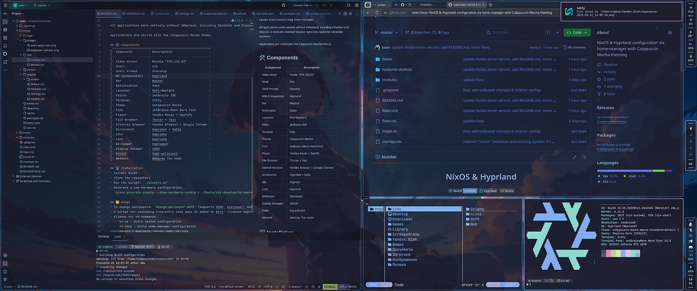
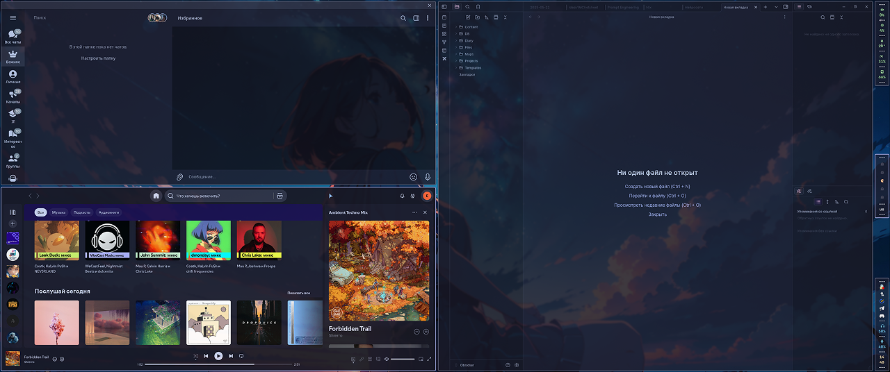
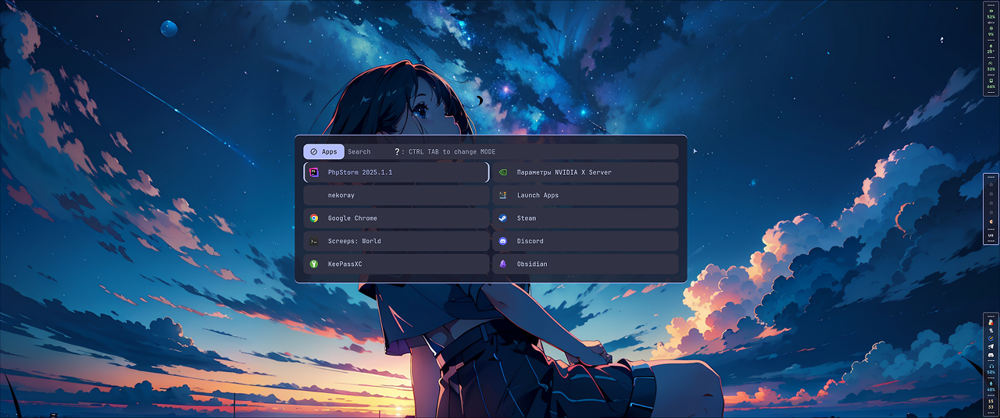

<h1 align="center">NixOS & Hyprland</h1>

<div align="center">

[](https://nixos.org)
[](https://hyprland.org)
[](https://nvidia.com)
[](https://github.com/catppuccin/catppuccin)
[](https://www.vim.org)
[](#-architecture--hosts)

</div>

## Table of Contents

- [Description](#-description)
- [Showcase](#-showcase)
- [Components & Stack](#-components--stack)
- [Repository Architecture](#-repository-architecture)
- [Installation & Deployment](#-installation--deployment)
- [Core Workflows & Productivity](#-core-workflows--productivity)
  - [1. Hotkeys Cheatsheet (`Super + /`)](#1-hotkeys-cheatsheet-super--)
  - [2. Smart Browser Dispatcher](#2-smart-browser-dispatcher)
  - [3. Power & Idle Management (`hypridle`)](#3-power--idle-management-hypridle)
  - [4. Smart Screenshots (Satty)](#4-smart-screenshots-satty)
  - [5. Wallpaper & Appearance](#5-wallpaper--appearance)
- [Fish Shell Helpers](#-fish-shell-helpers)
- [Development & Gaming](#-development--gaming)

---

## 📄 Description

A reliable, modular **NixOS** and **Hyprland** configuration with multi-host support (desktop workstation with proprietary Nvidia and laptop), managed declaratively through Flakes and Home Manager.

- **Zero XWayland Overhead:** Key desktop applications (including Obsidian, Discord, and browsers) run natively on Wayland.
- **Ultrawide Ergonomics:** Vertically-oriented Waybar minimizes horizontal scrolling on ultrawide monitors and preserves vertical display height.
- **Catppuccin Mocha Everywhere:** System-wide dark palette across the compositor, Ghostty terminal, Zed editor, Spicetify, GTK, browsers, and application launchers.
- **Vim-Centric Navigation:** Consistent HJKL modal navigation and split management across Hyprland, Ghostty, and Zed.

---

## 📸 Showcase

<p align="center">
  
</p>
<p align="center">
  
  
</p>

---

## 🛠️ Components & Stack

| Component                | Technology / Tool              | Details                                                                    |
| :----------------------- | :----------------------------- | :------------------------------------------------------------------------- |
| **Video Driver**         | Nvidia Proprietary             | Version **`595.99.02`**                                                    |
| **Compositor (WM)**      | Hyprland                       | Dynamically configured via Lua with LSP autocompletion                     |
| **Shell & Prompt**       | Fish + Starship                | Vi-mode, custom helper functions, Catppuccin prompt                        |
| **Status Bar**           | Waybar                         | Vertical layout, Cava audio bars, browser profile, idle status, gsimplecal |
| **Notifications**        | Swaync                         | Native notification center with do-not-disturb support                     |
| **Launchers**            | Vicinae + Rofi-Wayland         | Vicinae (`Super + Space`), Rofi auxiliary (`Super + Shift + Space`)        |
| **Editor**               | Zed                            | Vim mode, LSP integration, Catppuccin Mocha theme                          |
| **Terminal**             | Ghostty                        | Vim/Zed split keybinds, truecolor, JetBrains Mono Nerd Font                |
| **Theme**                | Catppuccin Mocha               | GTK, Kvantum, Qt, terminal, editors, and browser styling                   |
| **Music Player**         | Spotify (Spicetify)            | Wayland-native Spotify with Catppuccin Mocha & Adblockify                  |
| **File Managers**        | PCManFM-Qt + Yazi              | GUI file manager + high-speed terminal file manager                        |
| **Web Browsers**         | Yandex Browser + Google Chrome | Dual-browser setup with automatic workspace link routing                   |
| **Screenshots**          | Satty + Grim / Slurp           | Interactive annotation, region / window / monitor captures                 |
| **Screen Lock & Idle**   | Hyprlock + Hypridle            | Wayland-native locker with debounced toggle script                         |
| **Binary Compatibility** | Nix-LD                         | Run unpatched dynamic ELF binaries directly on NixOS                       |
| **Network / VPN**        | Throne                         | TUN mode integration                                                       |

---

## 🏗️ Repository Architecture

The repository is organized following clean separation of concerns: system modules, host-specific hardware definitions, and out-of-store mutable dotfiles for real-time development.

```
.
├── flake.nix             # Flake inputs and system/home outputs
├── overlays.nix          # Custom package overrides and patches
├── hosts/                # Machine-specific configurations
│   ├── nix-desktop/      # Workstation host (Nvidia driver, multi-monitor)
│   │   ├── configuration.nix
│   │   ├── hardware-configuration.nix
│   │   └── home-manager.nix
│   └── nix-laptop/       # Portable laptop host
│       ├── configuration.nix
│       ├── hardware-configuration.nix
│       └── home-manager.nix
├── modules/              # Reusable NixOS system modules
│   ├── core.nix          # Base system config (boot, audio, networking, locale)
│   ├── dev.nix           # Development stack (Docker, Nginx, PHP, Node.js, Zed)
│   ├── dev-hosts.nix     # Local virtual hosts definitions
│   ├── games.nix         # Steam, GameScope, and gaming optimizations
│   ├── nix-ld.nix        # Dynamic binary execution support
│   └── packages.nix      # Core desktop and system utilities
└── home/                 # Home Manager user environment
    ├── home.nix          # Main user module, wallpapers, session variables
    ├── packages.nix      # User applications (Ghostty, Spicetify, direnv)
    ├── files.nix         # Out-of-store symlinks to dotfiles (~/.nix-config)
    ├── fish.nix          # Fish functions, aliases, and Starship prompt
    ├── hypr/             # Hyprland Lua configuration and LSP stubs
    ├── vicinae/          # Custom Vicinae extensions (Hotkeys Cheatsheet)
    ├── zed/              # Zed settings, keymap, and tasks
    ├── waybar/           # Waybar styling, layout, and monitor scripts
    ├── rofi/             # Rofi configuration and Catppuccin themes
    └── scripts/          # System helpers (screenshots, idle toggle, wallpapers)
```

> [!TIP]
> Configuration files for GUI apps (Hyprland, Waybar, Zed, Vicinae) are decoupled into raw files (`.lua`, `.json`, `.css`) rather than inlined into Nix strings. This preserves native syntax highlighting, formatting, and LSP support in editors.

---

## 🖥️ Installation & Deployment

### 1. Initial Setup

1. Install NixOS on your machine.
2. Clone this repository to your preferred location (e.g. `~/Code/nixos/xsen`):
   ```bash
   git clone https://github.com/xsen/nixos.git ~/Code/nixos/xsen
   ```
3. Run the installer script:
   ```bash
   cd ~/Code/nixos/xsen
   ./install.sh
   ```

> [!NOTE]
> `./install.sh` establishes a symlink `~/.nix-config` pointing to this repository. This symlink is used by the `NH_FLAKE` variable and by helper scripts so configurations are always referenced reliably.

4. Generate your hardware configuration (for new machines):
   ```bash
   nixos-generate-config --show-hardware-config > ./hosts/nix-desktop/hardware-configuration.nix
   ```

### 2. Building & Switching

We use Fish wrapper functions over `nh` (Nix Helper) with automatic desktop notifications:

- **`nh-os`** — Rebuild and switch the NixOS system configuration (prompts with desktop alert if `sudo` credentials are required).
- **`nh-home`** — Rebuild and switch the Home Manager configuration.
- **`nh-all`** — Sequential rebuild of both system and home environments.
- **`nh-clean`** — Garbage collect and clean up old Nix generations (`nh clean all`).

---

## ⚡ Core Workflows & Productivity

### 1. Hotkeys Cheatsheet (`Super + /`)

Because complex keybindings across the window manager, terminal, and editor are easy to forget, an interactive cheatsheet extension is built directly into **Vicinae**:

- **Instant Access:** Press **`Super + /`** to pop up the cheatsheet.
- **Launcher Access:** Open Vicinae (**`Super + Space`**) and type `keys`, `cheatsheet`, or `хоткеи`.
- **Fuzzy Search:** Search shortcuts by action (`split`, `close`, `workspace`, `terminal`, `zoom`), key combination (`ctrl+w`, `alt+w`, `super`), or application.
- **Category Filter:** Filter by **Ghostty Terminal**, **Zed Editor**, or **Hyprland WM**.
- **Quick Copy:** Press `Enter` on any item to copy the key combination straight to the clipboard.

### 2. Smart Browser Dispatcher

Web links are routed automatically through a custom dispatcher configured as the default `$BROWSER`:

- **Automatic Workspace Routing:**
  - Links opened on **Workspaces 1 or 2** (Work Area) automatically open in Yandex Browser's **Work Profile (`Profile 1`)**.
  - Links opened on **Workspace 3+** (Personal Area) route to **Personal Profile (`Profile 2`)**.
- **Manual Mode Toggle:** Press **`Super + Shift + B`** to cycle between modes:
  - `Auto` — dynamic routing based on active workspace.
  - `Work` — forces all links to Work Profile.
  - `Chill` — forces all links to Personal Profile.
- **Waybar Indicator:** Displays current browser routing mode in the status bar.

### 3. Power & Idle Management (`hypridle`)

A dedicated debounced script (`home/scripts/hypridle.sh`) manages screen timeout and sleep:

- **Quick Toggle:** Press **`Super + I`** or click the idle icon in Waybar to toggle idle lock on/off (ideal for watching videos or long compiles).
- **Status Alerts:** Sends instant desktop notifications indicating whether idle mode is `Enabled` or `Disabled`.

### 4. Smart Screenshots (Satty)

Comprehensive screenshot tooling integrated with the **Satty** annotation tool:

- **`Print`** — Interactive region screenshot (`smart-screenshot.sh region`).
- **`Shift + Print`** — Capture the currently active window (`smart-screenshot.sh window`).
- **`Ctrl + Print`** — Capture the entire monitor output (`smart-screenshot.sh output`).

### 5. Wallpaper & Appearance

A single command updates backgrounds across all display surfaces synchronously:

```bash
change-wallpaper /path/to/image.png
```

This updates **SDDM**, **Hyprpaper** (active session desktop), and **Hyprlock** (lock screen) without manual reloads.

---

## 🐟 Fish Shell Helpers

The Fish configuration (`home/fish.nix`) comes loaded with productivity helpers:

- **`done <command>`** — Runs any long-running command and triggers a desktop notification when finished with execution time and exit status:
  ```bash
  done cargo build --release
  ```
- **`ssh` Wrapper** — Automatically maps `TERM=xterm-256color` when connecting from Ghostty, preventing _"unknown terminal type: xterm-ghostty"_ errors on remote hosts.
- **`update-hypr-stubs`** — Extracts the active Hyprland Lua typing stubs (`hl.meta.lua`) from the Nix Store and links them to the local config, enabling full Lua IDE autocomplete in Zed.
- **`, <package>`** — Runs any uninstalled Nix package instantly via `nix-index` and `comma` without entering a subshell:
  ```bash
  , htop
  ```
- **`b "<command>"`** — Runs arbitrary commands in Bash subshell directly from Fish.

---

## ⚙️ Development & Gaming

### Development Environment

- **Nix-LD:** Allows running precompiled, unpatched dynamic Linux binaries (VSCode remote server, Node/Go binaries, language servers, JetBrains tools) out of the box.
- **Development Services:** Docker and Nginx are configured as system services with local virtual hosts defined in `modules/dev-hosts.nix`.
- **Direnv:** `nix-direnv` is enabled for zero-latency per-directory environment switching when navigating projects.

### Gaming & Window Rules

- **Optimized Steam:** Proton and GameScope support configured in `modules/games.nix`.
- **Specialized Window Rules:** Dedicated window rules in `home/hypr/hyprland.lua` for games like EVE Online, Discord, Obsidian, and media players (preventing tearing, managing floating windows, and preserving ultrawide layouts).
